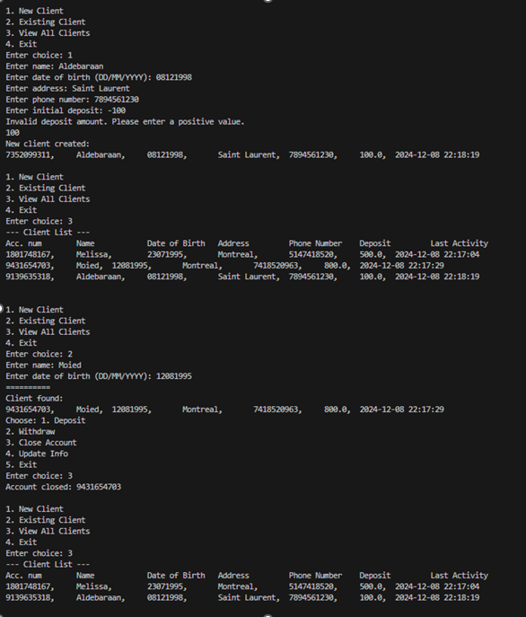

# Event-Driven Simulation: Bank Teller Simulation

## Overview
This project simulates a dynamic banking system where customers queue for services, and tellers process their transactions. The goal is to apply object-oriented programming principles and Java programming features to create a fully functional, event-driven simulation. The application is designed to handle basic banking operations like creating accounts, depositing/withdrawing money, updating client information, and managing client transactions.

## Project Objectives
- Strengthen understanding of object-oriented programming.
- Apply Java programming concepts (variables, loops, conditionals, file I/O, etc.).
- Design and implement a simulation where objects interact to drive state changes (e.g., customer transactions).
- Write modular, reusable, and maintainable code.

## Key Features:
- **New Client Handling**: Add new clients with their personal details and an initial deposit.
- **Existing Client Handling**: Manage existing clients' accounts, including deposits, withdrawals, account closure, and information updates.
- **Transaction Logging**: All banking transactions are logged in a file for future reference.
- **Client Data Persistence**: All client data is stored in a file ("clients.txt") and is loaded each time the program runs. Any changes to the client data are saved to this file.

## Components

### Bank Class
- The `Bank` class manages the main operations of the bank and simulates the teller-client interactions.
- It provides a menu of options for the teller to add new clients, handle existing clients, view all clients, or exit the program.
- Actions like deposit, withdrawal, account closure, and information updates are carried out through this class.
- The bank uses a `ClientFileManager` to load and save client data from a file.

### Client Class
- Represents a client with attributes like name, date of birth, address, phone number, balance, and account number.
- The account number is randomly generated and cannot be changed.
- The class includes methods for depositing and withdrawing money and updating client details like address and phone number.
  
### Teller Class
- Manages the bank's operations by interacting with clients.
- Allows adding new clients, finding clients by name and date of birth, and performing actions such as deposits, withdrawals, and closing accounts.
- The teller also logs all transactions to a file.

### Transaction Class
- Logs all transactions (e.g., deposits, withdrawals, account closures) to a file called "transaction_history.txt".
- Ensures that every action performed by the teller is documented for future reference.

### ClientFileManager Class
- Manages client data persistence by reading from and writing to a file ("clients.txt").
- It loads client information into a list of `Client` objects when the program starts and saves updated client data back to the file when changes are made.

## Example Flow
1. **Teller Menu**:
   - The teller is presented with a menu of options: 
     1.New Client
     2.Existing Client
     3.View All Clients
     4.Exit
   - The teller can choose to add a new client, interact with an existing client, view all clients, or exit.

2. **Handling a New Client**:
   - The teller can enter the client's name, date of birth, address, phone number, and an initial deposit to add a new client.

3. **Handling an Existing Client**:
   - The teller can search for an existing client by name and date of birth.
   - Once found, the teller can deposit or withdraw money, close the account, or update the client's information (address or phone number).

4. **Transaction Logging**:
   - Every action (e.g., deposit, withdrawal, account closure) is logged to a transaction history file.

5. **Client Data Persistence**:
   - Client data (e.g., name, balance, account number) is saved to a file and is loaded when the program runs again.
   
### Demo
Here’s a snapshot of the program in action:

## License
This project is licensed under the MIT License - see the [LICENSE](LICENSE) file for details.

## Acknowledgments
- This project was developed as part of a course assignment. All coding techniques and algorithms were implemented independently.
- Special thanks to the course instructors for their guidance throughout the development process.

---
# Author
Melissa :)  
Course: [Programming Concepts] 
Date: December 2024

